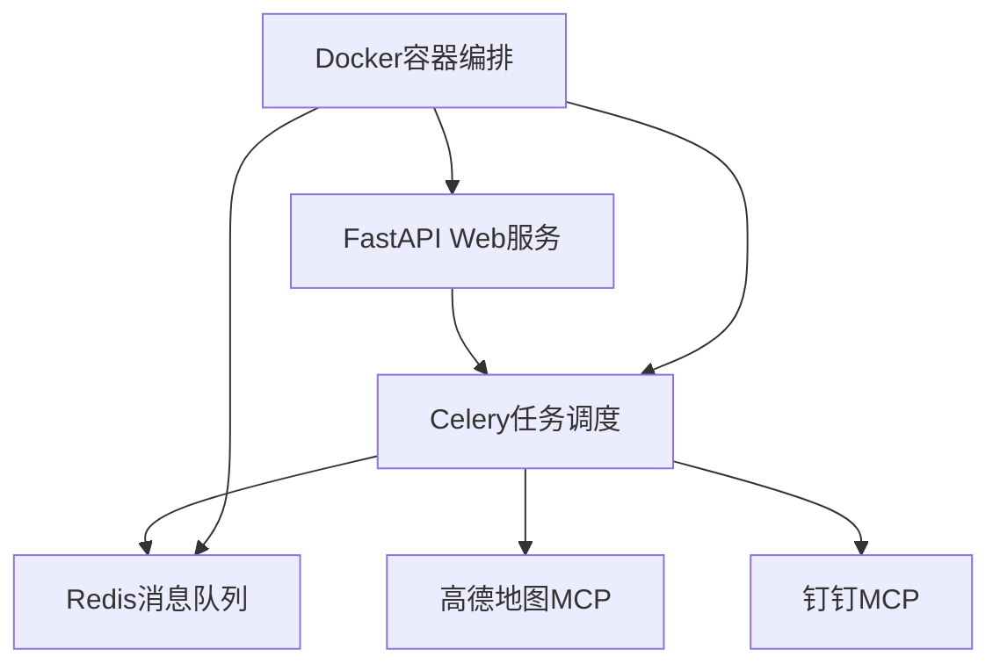

# MCP Commute Assistant

[](LICENSE)
[](https://www.python.org/)
[](#)

一个基于MCP（Model Context Protocol）的智能通勤助手，每天自动检查上班路线时长并通过钉钉推送通知。

## 🌟 功能特性

### 🏢 专业版功能
- 🚗 **智能路线规划** - 集成高德地图API，实时获取最优路线
- ⏰ **自动化调度** - 基于Celery的定时任务，每天准时推送
- 💬 **多渠道通知** - 钉钉机器人消息推送，支持文本和Markdown格式
- 🔧 **模块化架构** - 基于MCP协议的设计，易于扩展和维护
- 🐳 **容器化部署** - Docker Compose一键部署，支持生产环境
- 📊 **完整监控** - 多层次日志系统，完善的错误处理机制
- 🔒 **安全可靠** - 配置验证、重试机制、异常恢复
- 🧪 **全面测试** - 单元测试、集成测试覆盖核心功能

### 🎯 Dumb模式（小白版）
- 🚀 **极速上手** - 5分钟配置完成，零编程基础也能使用
- 📦 **极简依赖** - 只需requests一个包，无需复杂环境
- 🔧 **一体化设计** - 一个文件搞定所有功能
- 🎮 **多种运行模式** - 交互式、手动执行、定时任务
- 📱 **跨平台支持** - Windows/Mac/Linux/移动端都能运行
- 🆘 **详细引导** - 每步都有中文提示和错误处理

## 🏗️ 技术架构

### 核心组件



### 技术栈

| 层级 | 技术组件 | 说明 |
|------|----------|------|
| **应用层** | FastAPI 0.104.1 | 高性能Web框架 |
| **调度层** | Celery 5.3.4 | 分布式任务队列 |
| **存储层** | Redis 7 | 消息队列和缓存 |
| **业务层** | Pydantic 2.5.0 | 数据验证和序列化 |
| **日志层** | Loguru 0.7.2 | 结构化日志系统 |
| **部署层** | Docker Compose | 容器化部署 |

### MCP协议实现

- **高德地图MCP**: 路线规划、路况查询、距离计算
- **钉钉MCP**: 消息推送、群通知、错误告警

## 🚀 快速开始

### 🎯 小白模式（强烈推荐新手）

```bash
# 1. 进入dumb模式目录
cd dumb_mode

# 2. 安装最小依赖
pip install -r requirements.txt

# 3. 编辑配置文件
# 打开 commute_assistant.py，填写你的API Key和坐标

# 4. 运行程序
python commute_assistant.py
```

👉 [详细的小白模式使用说明](dumb_mode/README_DUMB.md)

### 🏢 专业模式

#### 环境准备

- Python 3.11+
- Docker & Docker Compose
- 高德地图API Key
- 钉钉机器人Webhook

#### 安装部署

```bash
# 1. 克隆项目
git clone <repository-url>
cd mcp4coder

# 2. 创建虚拟环境
python -m venv venv
source venv/bin/activate  # Linux/Mac
# 或
venv\Scripts\activate     # Windows

# 3. 安装依赖
pip install -r config/requirements.txt

# 4. 配置环境变量
cp config/.env.example .env
# 编辑.env文件，填入必要的API密钥和配置

# 5. 启动服务
docker-compose -f deployment/docker-compose.yml up -d

# 6. 验证服务状态
curl http://localhost:8000/health
```

#### 本地开发

```bash
# 启动开发服务器
python -m app.main

# 运行测试
pytest tests/ -v

# 代码质量检查
flake8 app/
black app/
mypy app/

# 运行配置检查
python scripts/health_check.py
```

## 📁 项目结构

```
mcp4coder/
├── app/                          # 核心应用代码（专业版）
│   ├── __init__.py              # 包初始化
│   ├── main.py                  # FastAPI应用入口
│   ├── config/                  # 配置管理
│   │   ├── __init__.py
│   │   ├── settings.py          # 应用配置
│   │   └── validators.py        # 配置验证器
│   ├── services/                # 业务服务层
│   │   ├── __init__.py
│   │   └── commute_service.py   # 通勤服务
│   ├── mcp/                     # MCP协议实现
│   │   ├── __init__.py
│   │   ├── amap_client.py       # 高德地图客户端
│   │   └── dingtalk_client.py   # 钉钉客户端
│   ├── workers/                 # Celery工作进程
│   │   ├── __init__.py
│   │   ├── celery_app.py        # Celery配置
│   │   └── tasks.py             # 任务定义
│   └── utils/                   # 工具函数
│       ├── __init__.py
│       ├── exceptions.py        # 自定义异常
│       ├── logger.py            # 日志系统
│       ├── logging_context.py   # 日志上下文
│       ├── error_handler.py     # 错误处理
│       └── helpers.py           # 通用工具
├── dumb_mode/                   # 🎯 小白模式（推荐新手）
│   ├── commute_assistant.py     # 一体化主程序
│   ├── simple_amap.py           # 简化高德API
│   ├── simple_dingtalk.py       # 简化钉钉通知
│   ├── requirements.txt         # 最小依赖
│   ├── README_DUMB.md           # 小白模式说明
│   └── config_example.txt       # 配置示例
├── tests/                       # 测试代码
│   ├── test_config.py           # 配置测试
│   ├── test_utils.py            # 工具函数测试
│   └── test_integration.py      # 集成测试
├── docker/                      # Docker配置
│   └── Dockerfile               # 应用镜像
├── docs/                        # 项目文档
├── logs/                        # 日志目录
├── config/                      # 配置文件目录
│   ├── .env.example             # 环境变量示例
│   ├── requirements.txt         # Python开发依赖
│   ├── requirements-prod.txt    # 生产环境依赖
│   └── pytest.ini               # 测试配置
├── deployment/                  # 部署配置目录
│   ├── docker-compose.yml       # 开发环境Docker编排
│   └── docker-compose.prod.yml  # 生产环境Docker编排
├── documentation/               # 文档目录
│   ├── README_PROFESSIONAL.md   # 专业版README
│   ├── CHANGELOG.md             # 更新日志
│   ├── PROJECT_SUMMARY.md       # 项目总结
│   └── SECURITY_CHECKLIST.md    # 安全检查清单
├── LICENSE                      # 开源许可证
└── README.md                    # 项目说明(主文档)
```

## ⚙️ 配置说明

### 环境变量配置

复制 `.env.example` 到 `.env` 并填写相应配置：

```env
# ===== 应用配置 =====
APP_ENV=production
DEBUG=False
LOG_LEVEL=INFO

# ===== 高德地图API配置 =====
AMAP_API_KEY=your_amap_api_key_here           # 高德开放平台申请的Key
AMAP_ORIGIN=116.481485,39.990464             # 出发地坐标(经度,纬度)
AMAP_DESTINATION=116.481485,39.990464        # 目的地坐标(经度,纬度)
AMAP_STRATEGY=0                              # 0-速度优先,1-费用优先,2-距离优先

# ===== 钉钉机器人配置 =====
DINGTALK_WEBHOOK_URL=https://oapi.dingtalk.com/robot/send?access_token=xxx
DINGTALK_SECRET=your_dingtalk_secret_here    # 机器人加签密钥
DINGTALK_KEYWORD=通勤提醒                     # 消息关键词

# ===== Redis配置 =====
REDIS_HOST=redis
REDIS_PORT=6379
REDIS_DB=0
REDIS_PASSWORD=

# ===== Celery配置 =====
CELERY_BROKER_URL=redis://redis:6379/1
CELERY_RESULT_BACKEND=redis://redis:6379/2
CELERY_TIMEZONE=Asia/Shanghai

# ===== 定时任务配置 =====
COMMUTE_CHECK_CRON=0 30 8 * * *              # 每天8:30执行
```

### 获取配置参数

1. **高德地图API Key**: [高德开放平台](https://lbs.amap.com/)注册并创建应用
2. **钉钉机器人**: 钉钉群设置 → 智能群助手 → 添加机器人 → 自定义机器人
3. **坐标获取**: 可通过高德地图网页版右键点击获取坐标

### 配置验证

```bash
# 启动开发模式验证配置
python -c "from app.config.settings import settings; print('配置加载成功')"

# 运行健康检查
python scripts/health_check.py
```

## 🧪 测试

### 运行测试

```bash
# 运行所有测试
pytest tests/ -v

# 运行特定测试
pytest tests/test_config.py -v

# 生成覆盖率报告
pytest --cov=app --cov-report=html tests/

# 运行集成测试
pytest -m integration tests/
```

### 测试覆盖

- ✅ 配置管理测试
- ✅ 工具函数测试
- ✅ 集成流程测试
- ✅ 异常处理测试

## 📊 API文档

启动服务后访问：

- **Swagger UI**: http://localhost:8000/docs
- **ReDoc**: http://localhost:8000/redoc

### 主要API端点

| 端点 | 方法 | 描述 |
|------|------|------|
| `/` | GET | 服务根路径 |
| `/health` | GET | 健康检查 |
| `/commute/check` | POST | 手动触发通勤检查 |
| `/commute/status/{task_id}` | GET | 查询任务状态 |
| `/config/info` | GET | 查看配置信息（开发环境） |
| `/test/notification` | POST | 测试通知发送（开发环境） |

## 🛠️ 开发指南

### 代码规范

```bash
# 代码格式化
black app/ tests/

# 代码检查
flake8 app/ tests/

# 类型检查
mypy app/
```

### 添加新功能

1. 在对应模块创建新文件
2. 编写单元测试
3. 更新相关文档
4. 运行完整测试套件

### 调试技巧

```python
# 启用详细日志
LOG_LEVEL=DEBUG

# 开发模式启动
DEBUG=True

# 查看Celery任务
celery -A app.workers.celery_app inspect active
```

## 🚀 部署指南

### 生产环境部署

```bash
# 构建生产镜像
docker-compose -f docker-compose.yml build

# 启动生产服务
docker-compose up -d

# 查看服务状态
docker-compose ps

# 查看日志
docker-compose logs -f
```

### 监控和维护

```bash
# 查看应用日志
tail -f logs/mcp_commute_$(date +%Y-%m-%d).log

# 查看错误日志
tail -f logs/error_$(date +%Y-%m-%d).log

# 重启服务
docker-compose restart

# 停止服务
docker-compose down
```

## 📚 相关文档

| 文档 | 路径 | 说明 | 适用人群 |
|------|------|------|----------|
| [小白模式说明](dumb_mode/README_DUMB.md) | `dumb_mode/README_DUMB.md` | 5分钟快速上手指南 | 新手用户 |
| [架构设计文档](docs/architecture.md) | `docs/architecture.md` | 系统架构详解 | 开发者 |
| [API接口文档](docs/api_reference.md) | `docs/api_reference.md` | RESTful API说明 | 开发者 |
| [部署手册](docs/deployment.md) | `docs/deployment.md` | 生产环境部署指南 | 运维人员 |
| [开发指南](docs/development.md) | `docs/development.md` | 贡献和开发说明 | 开发者 |
| [快速开始指南](docs/quick_start_guide.md) | `docs/quick_start_guide.md` | 详细操作步骤 | 所有用户 |
| [更新日志](documentation/CHANGELOG.md) | `documentation/CHANGELOG.md` | 版本变更记录 | 所有用户 |
| [项目总结](documentation/PROJECT_SUMMARY.md) | `documentation/PROJECT_SUMMARY.md` | 完整项目报告 | 管理者 |
| [安全检查](documentation/SECURITY_CHECKLIST.md) | `documentation/SECURITY_CHECKLIST.md` | 安全配置清单 | 安全人员 |
| [专业版README](documentation/README_PROFESSIONAL.md) | `documentation/README_PROFESSIONAL.md` | 详细技术文档 | 开发者 |

## 🤝 贡献指南

欢迎提交Issue和Pull Request！

1. Fork项目
2. 创建特性分支
3. 提交更改
4. 推送到分支
5. 创建Pull Request

## 📄 许可证

[MIT License](LICENSE)

## 🙏 致谢

- [FastAPI](https://fastapi.tiangolo.com/) - 高性能Web框架
- [Celery](https://docs.celeryproject.org/) - 分布式任务队列
- [高德开放平台](https://lbs.amap.com/) - 地图服务
- [钉钉开放平台](https://open.dingtalk.com/) - 消息推送

---

<p align="center">Made with ❤️ by Standup Coder</p>