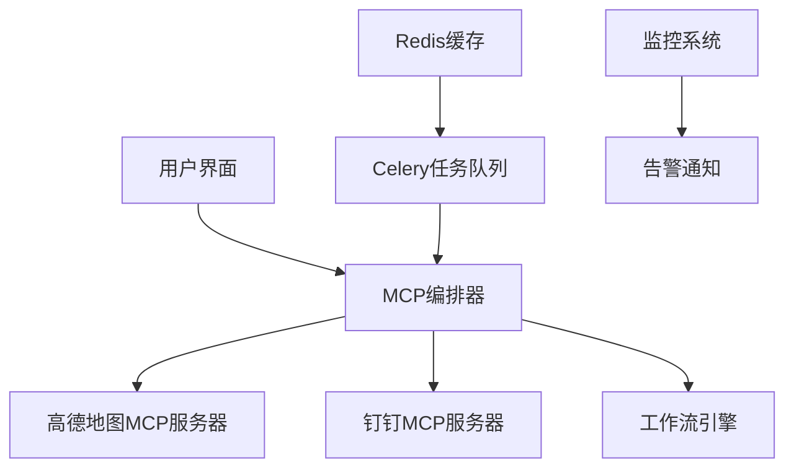

# 🚗 MCP4Coder - 智能通勤助手

[](https://www.python.org/)
[](LICENSE)
[](https://github.com/your-username/mcp4coder/actions)
[](https://codecov.io/)

基于 **Model Context Protocol (MCP)** 的智能通勤路线规划和通知系统，支持高德地图实时路况查询和钉钉消息推送。

## 🎯 为什么选择MCP4Coder？

### 🌟 双模式设计，满足所有用户需求

**👨‍💻 专业开发者模式**
- 完整的MCP协议实现
- 可扩展的插件化架构
- 企业级监控和告警系统
- 可视化工作流设计器

**🎯 小白用户模式 (Dumb Mode)**
- 5分钟快速上手
- 零编程基础也能使用
- 详细中文提示和错误处理
- 一个文件搞定所有功能

## 🚀 快速开始

### 🎯 小白模式（推荐新手，5分钟上手）

```bash
# 1. 进入dumb模式目录
cd dumb_mode

# 2. 安装最小依赖
pip install -r requirements.txt

# 3. 编辑配置文件
# 用文本编辑器打开 commute_assistant.py
# 在配置区域填写你的API Key和坐标

# 4. 运行程序
python commute_assistant.py
```

👉 [详细的小白模式使用说明](dumb_mode/README_DUMB.md)

### 🏢 专业模式（开发者使用）

```bash
# 1. 克隆项目
git clone https://github.com/your-username/mcp4coder.git
cd mcp4coder

# 2. 创建虚拟环境
python -m venv venv
source venv/bin/activate  # Linux/Mac
# 或
venv\Scripts\activate     # Windows

# 3. 安装依赖
pip install -r requirements.txt

# 4. 配置环境变量
cp .env.example .env
# 编辑.env文件，填入API密钥

# 5. 启动服务
docker-compose up -d

# 6. 验证运行
curl http://localhost:8000/health
```

## 📋 详细操作步骤

### 第一步：获取必要配置

#### 📍 高德地图API Key
1. 访问 [高德开放平台](https://lbs.amap.com/)
2. 注册账号并创建应用
3. 获取**Web服务API Key**（免费）

#### 🤖 钉钉机器人配置
1. 打开钉钉 → 选择群聊
2. 群设置 → 智能群助手 → 添加机器人
3. 选择自定义机器人
4. 获取**Webhook URL**

#### 🌍 坐标获取方法
1. 打开 [高德地图网页版](https://ditu.amap.com/)
2. 右键点击起点/终点位置
3. 选择"复制坐标"或查看经纬度信息
4. 格式：`经度,纬度`（如：`116.481485,39.990464`）

### 第二步：配置信息填写

#### Dumb模式配置
编辑 `dumb_mode/commute_assistant.py` 文件：

```python
# ==================== 配置区域 ====================

# 高德地图配置
AMAP_API_KEY = "你的高德API Key"           # 必填
HOME_LOCATION = "116.481485,39.990464"    # 家的坐标
WORK_LOCATION = "116.436795,39.974805"   # 公司的坐标

# 钉钉配置
DINGTALK_WEBHOOK = "https://oapi.dingtalk.com/robot/send?access_token=xxx"
DINGTALK_SECRET = "你的加签密钥（可选）"    # 可选

# =================================================
```

#### 专业模式配置
编辑 `.env` 文件：

```bash
# 高德地图API配置
AMAP_API_KEY=your_amap_api_key_here
AMAP_ORIGIN=116.481485,39.990464
AMAP_DESTINATION=116.436795,39.974805

# 钉钉机器人配置
DINGTALK_WEBHOOK_URL=https://oapi.dingtalk.com/robot/send?access_token=your_token
DINGTALK_SECRET=your_dingtalk_secret_here
```

### 第三步：运行和验证

#### 运行Dumb模式
```bash
# 交互式运行（推荐新手）
python commute_assistant.py

# 手动执行一次
python commute_assistant.py --manual

# 定时执行（每天8:30）
python commute_assistant.py --schedule

# 测试配置
python commute_assistant.py --test
```

#### 运行专业模式
```bash
# 启动所有服务
docker-compose up -d

# 查看服务状态
docker-compose ps

# 查看日志
docker-compose logs -f app

# 停止服务
docker-compose down
```

## 🎮 功能演示

### Dumb模式运行效果
```
🚗 智能通勤助手 (Dumb模式)
最简单的一站式通勤提醒解决方案

🤖 通勤助手交互模式
请选择执行方式:
1. 立即执行一次检查
2. 设置定时执行  
3. 测试配置

请输入选择 (1/2/3): 1

==================================================
🚀 开始执行通勤检查...
==================================================
⏰ 当前时间: 2024-01-01 08:30:00

📍 查询路线: 116.481485,39.990464 → 116.436795,39.974805
📡 正在调用高德地图API...
路线查询成功!
距离: 15.0 公里
时长: 30 分钟

📊 路线详情:
   距离: 15.0 公里
   时长: 30分钟
   平均速度: 30.0 km/h

📤 准备发送钉钉通知...
钉钉消息发送成功!
✅ 通勤检查完成!
```

### 收到的钉钉消息
```
🚗 通勤路线提醒

出发时间: 08:30
预计行程: 30分钟
行驶距离: 15.0公里

祝您一路顺风! 🎯
```

## 🏗️ 技术架构

### 核心组件



### 技术栈

| 层级 | 技术组件 | 用途 |
|------|----------|------|
| **协议层** | MCP (Model Context Protocol) | 标准化服务通信协议 |
| **应用层** | FastAPI + Python 3.11+ | RESTful API服务 |
| **调度层** | Celery + Redis | 异步任务调度 |
| **数据层** | Redis | 缓存和消息队列 |
| **监控层** | Prometheus + 自定义监控 | 系统监控和告警 |
| **部署层** | Docker + Docker Compose | 容器化部署 |

## 📁 项目结构

```
mcp4coder/
├── app/                          # 核心应用代码
│   ├── __init__.py
│   ├── main.py                  # FastAPI应用入口
│   ├── config/                  # 配置管理
│   ├── services/                # 业务服务层
│   ├── mcp/                     # MCP协议实现
│   │   ├── orchestrator.py      # 编排器核心
│   │   ├── server_manager.py    # 服务器管理
│   │   ├── servers/             # MCP服务器实现
│   │   └── workflow_dsl.py      # 工作流DSL
│   ├── workers/                 # Celery工作进程
│   ├── monitoring/              # 监控系统
│   └── utils/                   # 工具函数
├── dumb_mode/                   # 🎯 小白模式
│   ├── commute_assistant.py     # 一体化主程序
│   ├── simple_amap.py           # 简化高德API
│   ├── simple_dingtalk.py       # 简化钉钉通知
│   └── README_DUMB.md           # 小白模式说明
├── web/                         # 前端界面
│   └── workflow_designer.html   # 可视化工作流设计器
├── tests/                       # 测试代码
├── docker/                      # Docker配置
├── docs/                        # 项目文档
├── scripts/                     # 脚本工具
├── examples/                    # 使用示例
├── .github/workflows/           # CI/CD配置
├── docker-compose.yml           # 开发环境部署
├── docker-compose.prod.yml      # 生产环境部署
├── requirements.txt             # 开发依赖
├── requirements-prod.txt        # 生产依赖
├── .env.example                 # 环境变量模板
└── README.md                    # 项目说明
```

## 🛠️ 高级功能

### 1. 可视化工作流设计
访问 `web/workflow_designer.html` 使用拖拽式工作流设计器：

- 🎯 拖拽节点创建工作流
- 🔧 配置MCP服务器和工具
- 📊 实时预览工作流结构
- 💾 导出JSON/YAML格式

### 2. 系统监控面板
```bash
# 访问监控端点
curl http://localhost:8000/metrics     # Prometheus指标
curl http://localhost:8000/health      # 健康检查
curl http://localhost:8000/alerts      # 告警信息
```

### 3. 性能分析
```bash
# 运行性能分析脚本
python scripts/health_check.py
```

## 🔧 故障排除

### 常见问题及解决方案

#### ❓ API调用失败
```bash
# 检查网络连接
ping restapi.amap.com
ping oapi.dingtalk.com

# 验证API Key
curl "https://restapi.amap.com/v3/direction/driving?key=YOUR_KEY&origin=116,39&destination=116,39"
```

#### ❓ 钉钉消息发送失败
- 检查Webhook URL是否正确
- 确认是否需要加签密钥
- 验证网络防火墙设置

#### ❓ Docker容器启动失败
```bash
# 查看容器日志
docker-compose logs app
docker-compose logs redis

# 重建容器
docker-compose down -v
docker-compose up --build
```

#### ❓ 定时任务不执行
```bash
# 检查Celery工作进程
docker-compose ps celery-worker
docker-compose logs celery-beat

# 手动触发任务测试
curl -X POST http://localhost:8000/api/tasks/trigger-commute-check
```

### 系统诊断命令

```bash
# 运行完整健康检查
python scripts/health_check.py

# 检查依赖包
pip check

# 验证配置
python -c "from app.config.settings import settings; print(settings.dict())"
```

## 📚 详细文档

| 文档 | 说明 | 适用人群 |
|------|------|----------|
| [小白模式说明](dumb_mode/README_DUMB.md) | 5分钟快速上手指南 | 新手用户 |
| [架构设计文档](docs/architecture.md) | 系统架构详解 | 开发者 |
| [API接口文档](docs/api_reference.md) | RESTful API说明 | 开发者 |
| [部署手册](docs/deployment.md) | 生产环境部署指南 | 运维人员 |
| [开发指南](docs/development.md) | 贡献和开发说明 | 开发者 |
| [更新日志](CHANGELOG.md) | 版本变更记录 | 所有用户 |

## 🤝 贡献指南

欢迎任何形式的贡献！

### 开发流程
1. Fork项目
2. 创建特性分支：`git checkout -b feature/AmazingFeature`
3. 提交更改：`git commit -m 'Add some AmazingFeature'`
4. 推送分支：`git push origin feature/AmazingFeature`
5. 开启Pull Request

### 代码规范
- 遵循PEP8编码规范
- 使用Black格式化代码
- 添加类型提示和文档字符串
- 编写相应的测试用例

## 📄 许可证

本项目采用 MIT 许可证 - 查看 [LICENSE](LICENSE) 文件了解详情

## 🙏 致谢

- 高德地图开放平台提供的API服务
- 钉钉开放平台的机器人支持
- 所有开源项目的贡献者们

---

<p align="center">
  Made with ❤️ by the MCP4Coder Team<br>
  <a href="https://github.com/your-username/mcp4coder/issues">报告问题</a> • 
  <a href="https://github.com/your-username/mcp4coder/discussions">讨论交流</a>
</p>