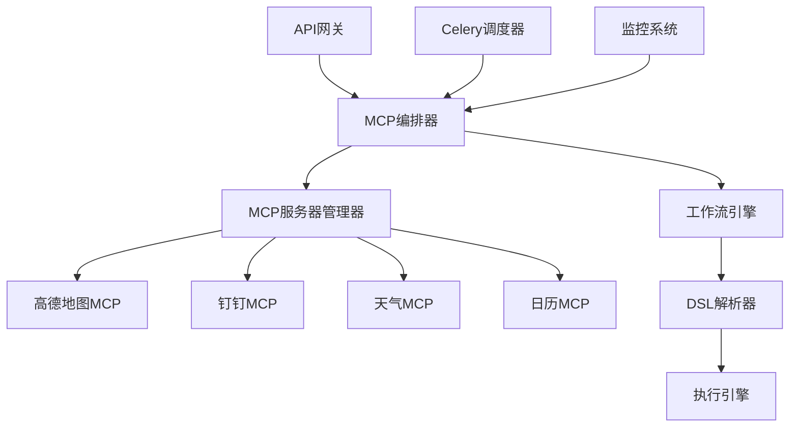
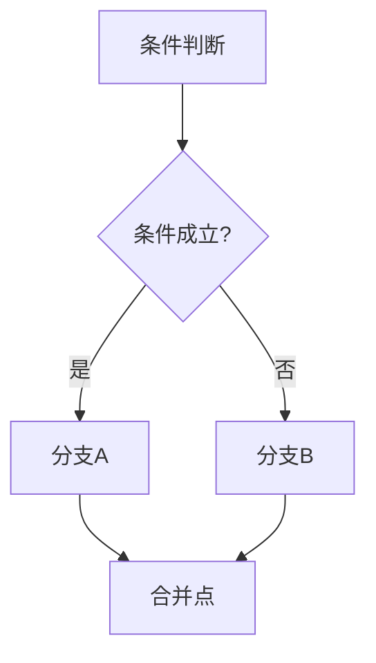
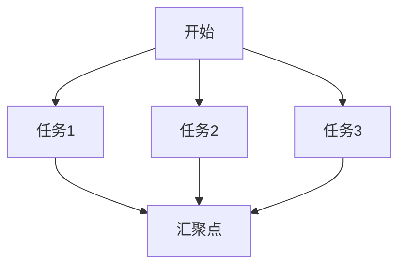

# MCP架构设计文档

## 概述

本文档详细介绍MCP Commute Assistant项目的架构设计，包括MCP协议实现、编排引擎设计和扩展机制。

## 架构总览



## 核心组件

### 1. MCP编排器 (MCPWorkflowEngine)

**职责**：
- 管理MCP服务器生命周期
- 编排工作流执行
- 处理任务依赖关系
- 提供重试和容错机制

**关键特性**：
```python
class MCPWorkflowEngine:
    def register_server(self, server: MCPServer) -> bool:
        """注册MCP服务器"""
        pass
    
    def register_workflow(self, workflow: WorkflowDefinition) -> bool:
        """注册工作流定义"""
        pass
    
    async def execute_workflow(self, workflow_id: str, variables: Dict) -> OrchestrationResult:
        """执行工作流"""
        pass
```

### 2. 服务器管理器 (MCPServerManager)

**职责**：
- MCP服务器进程管理
- 健康检查和自动恢复
- 负载均衡和资源监控
- 动态扩缩容

**监控指标**：
- 进程状态 (运行/停止/错误)
- 响应时间统计
- 错误率监控
- 资源使用情况

### 3. 工作流DSL引擎

**DSL语法示例**：
```yaml
name: "Daily Commute Check"
nodes:
  - id: "calculate_route"
    type: "mcp_tool"
    config:
      server: "amap-mcp-server"
      tool: "calculate_route"
    inputs:
      origin: "${variables.home}"
      destination: "${variables.work}"
```

## MCP协议实现

### 标准MCP服务器接口

```python
class BaseMCPServer:
    async def handle_tool_call(self, request: ToolCallRequest) -> ToolCallResponse:
        """处理工具调用"""
        pass
    
    async def read_resource(self, uri: str) -> ResourceContents:
        """读取资源"""
        pass
    
    def list_tools(self) -> List[Tool]:
        """列出可用工具"""
        pass
    
    def list_resources(self) -> List[Resource]:
        """列出可用资源"""
        pass
```

### 支持的MCP服务器类型

| 服务器类型 | 功能描述 | 并发限制 | 健康检查间隔 |
|-----------|----------|----------|--------------|
| 高德地图 | 路线规划、路况查询 | 5 | 60秒 |
| 钉钉通知 | 消息推送、群通知 | 10 | 60秒 |
| 天气服务 | 天气查询、预报 | 20 | 120秒 |
| 日历服务 | 日程管理、节假日 | 15 | 120秒 |

## 工作流编排模式

### 1. 顺序执行模式


### 2. 条件分支模式


### 3. 并行执行模式


## 扩展机制

### 添加新的MCP服务器

1. **创建服务器类**：
```python
# app/mcp/servers/news_server.py
class NewsMCPServer(BaseMCPServer):
    def __init__(self):
        super().__init__("news-mcp-server")
        self._register_tools()
    
    async def get_latest_news(self, category: str) -> Dict:
        # 实现新闻获取逻辑
        pass
```

2. **注册到工厂**：
```python
# app/mcp/server_factory.py
ServerType.NEWS: ManagedServer(
    name="news-mcp-server",
    command="python",
    args=["-m", "app.mcp.servers.news_server"],
    max_concurrent=10
)
```

### 自定义工作流节点

```python
# 注册自定义节点处理器
workflow_engine.register_step_handler(
    TaskType.CUSTOM_ANALYSIS,
    custom_analysis_handler
)

async def custom_analysis_handler(step, inputs, context):
    # 自定义分析逻辑
    return analysis_result
```

## 性能优化

### 1. 缓存策略
- MCP服务器响应缓存
- 常用数据本地缓存
- 工作流执行结果缓存

### 2. 异步处理
- 异步I/O操作
- 并发任务执行
- 非阻塞通信

### 3. 资源管理
- 连接池管理
- 内存使用优化
- CPU密集型任务分离

## 监控和告警

### 监控维度

1. **系统层面**
   - 服务器进程状态
   - 资源使用率 (CPU、内存、磁盘)
   - 网络连接状态

2. **业务层面**
   - 工作流执行成功率
   - 任务执行耗时统计
   - 错误率和异常分布

3. **用户体验**
   - 响应时间分布
   - 用户操作频率
   - 系统可用性指标

### 告警策略

```python
# 告警规则配置
ALERT_RULES = {
    "server_down": {
        "condition": "server.status == 'down'",
        "severity": "critical",
        "notify_channels": ["dingtalk", "email"]
    },
    "high_error_rate": {
        "condition": "error_rate > 0.05",
        "severity": "warning",
        "notify_channels": ["dingtalk"]
    }
}
```

## 部署架构

### 容器化部署
```yaml
# docker-compose.yml
services:
  mcp-orchestrator:
    build: .
    depends_on:
      - redis
      - mcp-amap
      - mcp-dingtalk
  
  mcp-amap:
    build: ./servers/amap
    environment:
      - AMAP_API_KEY=${AMAP_API_KEY}
  
  mcp-dingtalk:
    build: ./servers/dingtalk
    environment:
      - DINGTALK_WEBHOOK=${DINGTALK_WEBHOOK}
```

### 高可用部署
- 多实例负载均衡
- 数据持久化
- 故障自动切换
- 滚动升级支持

## 安全考虑

### 1. 访问控制
- API密钥认证
- 服务器间安全通信
- 权限分级管理

### 2. 数据保护
- 敏感信息加密存储
- 传输数据加密
- 日志脱敏处理

### 3. 输入验证
- 参数合法性检查
- 防止注入攻击
- 资源访问控制

## 未来发展

### 短期目标
- [ ] 完善可视化设计器
- [ ] 增强监控告警系统
- [ ] 优化性能和稳定性

### 长期规划
- [ ] 支持更多MCP服务器类型
- [ ] 实现分布式编排
- [ ] 提供Web管理界面
- [ ] 集成AI辅助编排

---

*本文档将持续更新以反映最新的架构设计和实现细节。*